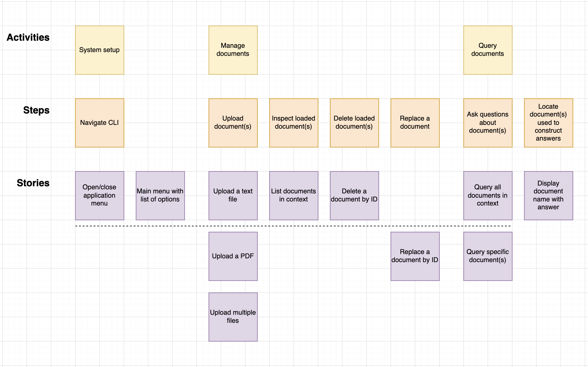

### Motivation
The motivation of this project is to:
1. Build on user story mapping skills.
2. Internalise the patterns associated with Hexagonal Architecture.
3. Understand how retrieval augmented generation pipelines work in practice.
4. Play with local embedding models, become familiar around vectors as a data store, experiment with embedding strategies, and get exposure to working with LLM APIs.
5. Learn how to build effective LLM evaluation processes.

#### User Story Mapping
